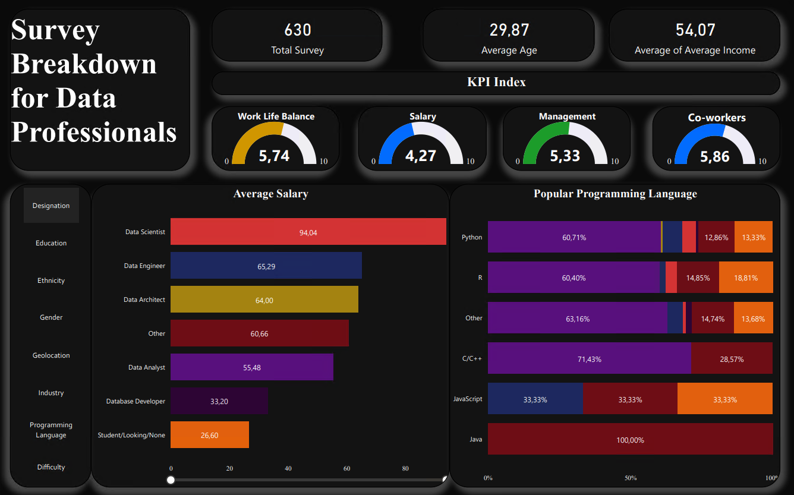

# Survey Breakdown for Data Professionals

## Overview

This project provides a detailed analysis of survey data collected from data professionals. The survey aimed to gather insights into various aspects of the data profession, including average salary, preferred programming languages, job satisfaction, and more. The project presents these insights through an interactive Power BI dashboard, which is included in this repository.

## Introduction

In the ever-evolving field of data science and analytics, understanding the trends, preferences, and challenges faced by data professionals is crucial. This survey project aims to provide valuable insights into the world of data professionals, helping organizations and individuals understand domain.

## Dashboard Preview

Here's a preview of the interactive Power BI dashboard generated from the survey data:

